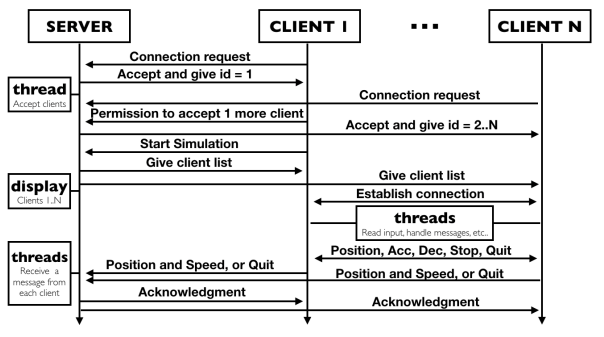
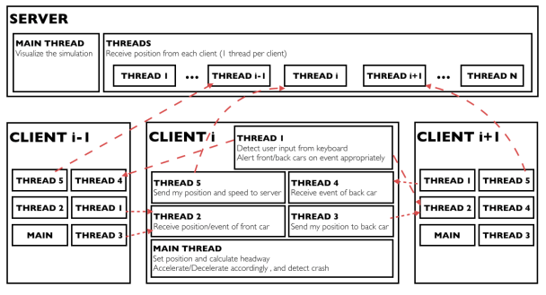
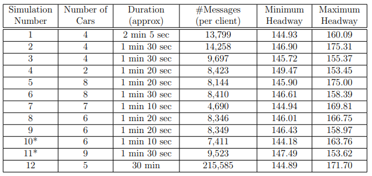

# A distributed system project on P2P based platoon simulation model

This proejct attempts to address the problem of platooning, also known as flocking of automobiles to increase road capacity. The goal is to maintain a constant headway within the platoon based on distributed systems concepts. Our primitive approach tackles this problem in a single lane and demonstrates how V2V communication contributes towards achieving this goal. A detailed overview of the project can be found at [final report](./proj/final_report.pdf).

## A brief overview on design and implementation
Please refer to the final report for details. 

### Message passing between server and clients

### Overview of server and client threads

### Result

  
*indicates simulations run with clients on the same computer (simulation no. 10, 11). 
